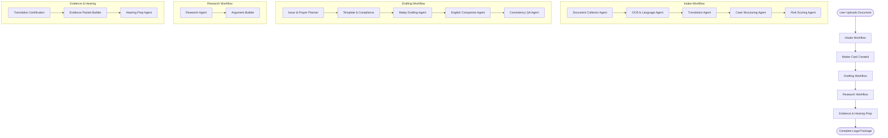

# 🔄 Agent Workflow Documentation - Malaysian Legal AI Agent

## Overview

The Malaysian Legal AI Agent system uses **15 specialized agents** orchestrated through **LangGraph workflows**. Each agent has a specific role in processing legal documents and generating bilingual pleadings.

---

## 🎯 Complete Agent Workflow



---

## 📋 Workflow 1: Intake Workflow

**Purpose**: Convert raw client documents into structured matter cards with risk assessment.

**Trigger**: User uploads documents via frontend or API

**Flow**:

### Step 1: Document Collector Agent
**Input**: Raw files (PDF, images, text, email, WhatsApp)
**Process**:
- Accepts files from multiple sources (upload, Gmail, WhatsApp, DMS)
- Calculates SHA-256 hash for deduplication
- Detects file type and determines if OCR is needed
- Stores files in local/cloud storage
- Creates document manifest

**Output**:
```json
{
  "document_manifest": [
    {
      "document_id": "DOC-xxx",
      "filename": "contract.pdf",
      "file_hash": "sha256...",
      "ocr_needed": true,
      "connector_type": "upload"
    }
  ],
  "total_documents": 1
}
```

---

### Step 2: OCR & Language Detection Agent
**Input**: Document manifest from Step 1
**Process**:
- Extracts text from PDFs/images using Tesseract OCR
- Splits text into sentences
- Detects language for each sentence (Malay/English)
- Calculates confidence scores
- Creates text segments

**Output**:
```json
{
  "segments": [
    {
      "segment_id": "SEG-001",
      "text": "PLAINTIF ialah sebuah syarikat...",
      "language": "ms",
      "confidence": 0.95,
      "page": 1,
      "position": 0
    }
  ]
}
```

**Technologies**: Tesseract OCR, langdetect library

---

### Step 3: Translation Agent
**Input**: Text segments from Step 2
**Process**:
- Translates Malay → English and English → Malay
- Preserves legal terms (PLAINTIF, DEFENDAN, MAHKAMAH)
- Provides both literal and idiomatic translations
- Calculates alignment scores
- Flags segments needing human review

**Output**:
```json
{
  "parallel_texts": [
    {
      "source": "PLAINTIF ialah sebuah syarikat",
      "source_lang": "ms",
      "literal": "PLAINTIF is a company",
      "idiomatic": "The PLAINTIFF is a company",
      "alignment_score": 0.92,
      "human_review": false
    }
  ]
}
```

**Technology**: Google Gemini API for translation

---

### Step 4: Case Structuring Agent
**Input**: Parallel texts from Step 3
**Process**:
- Extracts parties (plaintiff, defendant)
- Identifies court and jurisdiction
- Extracts key dates
- Identifies legal issues
- Extracts remedies sought
- Estimates case value
- Uses LLM + regex patterns

**Output**:
```json
{
  "matter_snapshot": {
    "parties": [
      {
        "role": "plaintiff",
        "name": "SYARIKAT ABC SDN BHD",
        "company_no": "123456-X"
      }
    ],
    "court": "High Court",
    "jurisdiction": "Kuala Lumpur",
    "case_type": "breach_of_contract",
    "issues": ["Non-payment", "Breach of contract"],
    "remedies_sought": ["RM 500,000", "Interest", "Costs"],
    "key_dates": ["2024-01-15", "2024-02-10"],
    "estimated_value": 500000,
    "confidence": 0.88
  }
}
```

**Technology**: Google Gemini LLM + regex

---

### Step 5: Risk Scoring Agent
**Input**: Matter snapshot from Step 4
**Process**:
- Scores 4 dimensions (1-5 scale):
  1. **Jurisdictional Complexity**: Multiple jurisdictions, cross-border
  2. **Language Complexity**: Mixed languages, technical terms
  3. **Volume Risk**: Number of documents, pages
  4. **Time Pressure**: Deadlines, urgency
- Calculates composite score
- Provides recommendations

**Output**:
```json
{
  "risk_scores": {
    "jurisdictional_complexity": 1,
    "language_complexity": 1,
    "volume_risk": 1,
    "time_pressure": 2,
    "composite_score": 1.25,
    "risk_level": "LOW",
    "recommendations": [
      "Standard workflow suitable",
      "Single paralegal can handle"
    ]
  }
}
```

**Result**: Matter Card created with ID `MAT-xxx`

---

## 📝 Workflow 2: Drafting Workflow

**Purpose**: Generate bilingual legal pleadings with QA checks

**Trigger**: User initiates drafting from Matter Card

**Flow**:

### Step 6: Issue & Prayer Planner Agent
**Input**: Matter snapshot
**Process**:
- Identifies legal theories and causes of action
- Searches mock precedent database
- Suggests prayers (remedies)
- Maps prayers to templates
- Calculates confidence for each issue

**Output**:
```json
{
  "issues": [
    {
      "id": "ISS-01",
      "title": "Breach of contract - non-payment",
      "legal_basis": ["Contract Act 1950 s.40"],
      "theory": "primary",
      "confidence": 0.92,
      "precedents": ["Case A v Case B [2020]"]
    }
  ],
  "suggested_prayers": [
    {
      "text_ms": "Penghakiman untuk jumlah RM 500,000",
      "text_en": "Judgment for the sum of RM 500,000",
      "template_id": "TPL-PRAYER-MONEY",
      "priority": "primary"
    }
  ]
}
```

---

### Step 7: Template & Compliance Agent
**Input**: Jurisdiction, court, matter type
**Process**:
- Selects appropriate pleading template
- Checks language compliance rules:
  - **Peninsular Malaysia High Court**: Malay required
  - **East Malaysia High Court**: English allowed
  - **Federal Court**: Either language
- Flags compliance warnings
- Provides template snippets

**Output**:
```json
{
  "template": {
    "template_id": "TPL-HighCourt-MS-v2",
    "name": "High Court Statement of Claim (Malay)",
    "language": "ms",
    "court_level": "high_court",
    "jurisdiction": "peninsular"
  },
  "compliance_warnings": [],
  "redlines_needed": false
}
```

---

### Step 8: Malay Drafting Agent
**Input**: Matter snapshot, template, issues, prayers
**Process**:
- Uses Gemini LLM to draft formal legal Malay
- Applies legal register and terminology
- Capitalizes defined terms (PLAINTIF, DEFENDAN)
- Numbers paragraphs
- Creates paragraph mapping for alignment

**Output**:
```json
{
  "pleading_ms_text": "DALAM MAHKAMAH TINGGI MALAYA...",
  "paragraph_map": {
    "1": "PLAINTIF ialah sebuah syarikat...",
    "2": "DEFENDAN ialah sebuah syarikat...",
    "3": "Pada atau sekitar 15 Januari 2024..."
  },
  "defined_terms": ["PLAINTIF", "DEFENDAN", "Perjanjian"],
  "confidence": 0.90
}
```

**Technology**: Google Gemini 2.0 Flash

---

### Step 9: English Companion Draft Agent
**Input**: Malay pleading from Step 8
**Process**:
- Translates Malay pleading to English using Gemini
- Maintains legal formatting
- Creates paragraph-level alignment
- Flags divergences (numbers, dates, terms)
- For internal review only (not for filing)

**Output**:
```json
{
  "pleading_en_text": "IN THE HIGH COURT OF MALAYA...",
  "aligned_pairs": [
    {
      "para_num": "1",
      "ms": "PLAINTIF ialah sebuah syarikat...",
      "en": "The PLAINTIFF is a company..."
    }
  ],
  "divergence_flags": [
    {
      "paragraph": "3",
      "type": "date_mismatch",
      "severity": "high"
    }
  ]
}
```

---

### Step 10: Consistency & Translation-QA Agent
**Input**: Malay pleading, English companion, aligned pairs
**Process**:
- Checks for missing paragraphs
- Verifies defined term consistency
- Validates matching dates and sums
- Checks citation alignment
- Calculates pass/fail for each check
- Determines if human review is required

**Output**:
```json
{
  "consistency_report": [
    {
      "check": "paragraph_count",
      "status": "PASS",
      "details": "Both versions have 25 paragraphs"
    },
    {
      "check": "defined_terms",
      "status": "PASS",
      "details": "PLAINTIF/PLAINTIFF consistent"
    },
    {
      "check": "dates",
      "status": "PASS",
      "details": "All dates match"
    },
    {
      "check": "sums",
      "status": "PASS",
      "details": "RM 500,000 consistent"
    }
  ],
  "block_for_human": false,
  "passed_checks": 4,
  "failed_checks": 0
}
```

**Result**: Bilingual pleading ready for review

---

## 🔍 Workflow 3: Research Workflow

**Purpose**: Find relevant legal authorities and build arguments

**Trigger**: User requests research for specific issues

### Step 11: Research Agent (NOW WITH LIVE DATA! ✨)

**NEW**: The Research Agent now scrapes **live Malaysian legal cases** from CommonLII!

**Input**: Legal query, filters (court, year, binding status)

**Process**:
- **PRIMARY**: Searches CommonLII Malaysia in real-time
  - Queries: `http://www.commonlii.org/cgi-bin/sinosrch.cgi`
  - Supports Federal Court, Court of Appeal, High Courts
  - Rate-limited to 1 request/second (respectful scraping)
  - HTML parsing for case metadata extraction
  - Returns up-to-date Malaysian case law
- **FALLBACK**: Uses mock database on errors
  - Automatic fallback on network failures
  - Silent degradation (logged but transparent to users)
  - Ensures system reliability

**Features**:
- Real-time web scraping with BeautifulSoup
- Retry logic with exponential backoff (max 3 attempts)
- Bilingual headnotes (English primary, Malay when available)
- Court hierarchy filtering
- Relevance ranking

**Output**:
```json
{
  "cases": [
    {
      "citation": "[2020] 1 MLJ 123",
      "title": "ABC Sdn Bhd v XYZ Sdn Bhd",
      "court": "Federal Court",
      "year": 2020,
      "headnote_en": "Contract - Breach - Remedies...",
      "headnote_ms": "Kontrak - Pelanggaran - Remedi...",
      "url": "http://www.commonlii.org/my/cases/MYFC/2020/...",
      "binding": true,
      "relevance_score": 0.95
    }
  ],
  "total_results": 15,
  "data_source": "commonlii",  // or "mock"
  "live_data": true
}
```

**Technology**: 
- CommonLII web scraping (primary)
- BeautifulSoup4 + lxml for HTML parsing
- httpx for async HTTP requests
- Mock database (fallback)

**Configuration**:
- Environment variable: `USE_COMMONLII=true` (default)
- Set to `false` to use only mock data


---

### Step 12: Argument Builder Agent
**Input**: Issues, relevant cases
**Process**:
- Uses Gemini LLM to build legal arguments
- Incorporates case authorities
- Generates bilingual issue memos
- Suggests wording for submissions

**Output**:
```json
{
  "issue_memo_en": "# Issue 1: Breach of Contract\n\nThe plaintiff...",
  "issue_memo_ms": "# Isu 1: Pelanggaran Kontrak\n\nPlaintif...",
  "suggested_wording": [
    "It is submitted that the defendant's failure..."
  ]
}
```

---

## 📦 Workflow 4: Evidence & Hearing Prep

**Purpose**: Prepare court bundles and hearing materials

### Step 13: Translation Certification Agent
**Input**: Source documents, target language
**Process**:
- Creates working translations
- Generates certification checklist
- Drafts affidavit template for certified translator

**Output**:
```json
{
  "working_translation": "...",
  "certification_checklist": [
    "Verify translator qualifications",
    "Check translation accuracy",
    "Prepare affidavit"
  ],
  "affidavit_draft": "I, [Name], certify that..."
}
```

---

### Step 14: Evidence Packet Builder Agent
**Input**: Matter ID, documents, pleadings, translations
**Process**:
- Creates comprehensive index
- Maps originals to translations
- Generates PDF assembly plan
- Tracks version history

**Output**:
```json
{
  "evidence_packet": {
    "sections": [
      {
        "tab": "A",
        "title": "Pleadings",
        "documents": ["Statement of Claim"]
      },
      {
        "tab": "B",
        "title": "Affidavits",
        "documents": ["Affidavit of Service"]
      }
    ]
  },
  "version_history": [
    {
      "version": "v1.0",
      "date": "2024-12-02",
      "changes": "Initial bundle"
    }
  ]
}
```

---

### Step 15: Hearing Prep & Live Assistance Agent
**Input**: Matter snapshot, pleadings, cases
**Process**:
- Creates tabbed hearing bundle
- Generates bilingual oral submission scripts
- Prepares FAQs for judge questions
- Provides authority citations

**Output**:
```json
{
  "hearing_bundle": {
    "tabs": ["Pleadings", "Affidavits", "Authorities"]
  },
  "oral_script_ms": "Yang Arif, kes ini melibatkan...",
  "oral_script_en_notes": "[For internal reference only]",
  "if_judge_asks": [
    {
      "question": "What is the legal basis?",
      "answer": "Contract Act 1950, s.40",
      "authority": "[2020] 1 MLJ 123"
    }
  ]
}
```

---

## 🔄 Integration Points

### Backend → Frontend
- **API**: REST endpoints on port 8005
- **Data Format**: JSON responses
- **Real-time**: WebSocket (planned)

### Frontend → Backend
- **File Upload**: Multipart form data
- **Workflow Triggers**: POST requests
- **State Management**: React Query for caching

### Agent → Agent
- **Orchestration**: LangGraph StateGraph
- **State Passing**: WorkflowState TypedDict
- **Error Handling**: Try-catch with fallback responses

---

## 📊 Data Flow Example

**User uploads contract.pdf** →
1. **Document Collector**: Stores file, creates DOC-xxx
2. **OCR Agent**: Extracts "PLAINTIF ialah..."
3. **Translation**: "The PLAINTIFF is..."
4. **Case Structuring**: Extracts parties, court, RM 500,000
5. **Risk Scoring**: Low complexity (1.25/5)
6. **Matter Card**: MAT-xxx created

**User clicks "Draft Pleading"** →
7. **Issue Planner**: Suggests "Breach of contract"
8. **Template**: Selects High Court Malay template
9. **Malay Drafting**: Generates formal pleading
10. **English Companion**: Creates aligned English version
11. **QA Check**: Verifies consistency → PASS

**Result**: Bilingual pleading ready for lawyer review

---

## 🎯 Key Features

### Bilingual Support
- All agents handle Malay ↔ English
- Preserves legal terminology
- Paragraph-level alignment

### Quality Assurance
- Confidence scoring at each step
- Human-in-the-loop checkpoints
- Consistency verification

### Audit Trail
- Every agent action logged
- Version history tracked
- Source references maintained

### Scalability
- Async processing
- Parallel agent execution
- Database-backed state

---

## 🚀 Next Steps

1. **Frontend Integration**: Connect UI to all workflows
2. **WebSocket**: Real-time progress updates
3. **Authentication**: Secure user access
4. **Production Deploy**: Docker + CI/CD

---

This workflow ensures **high-quality, bilingual legal documents** with **automated QA** and **comprehensive audit trails** for Malaysian legal practice.
