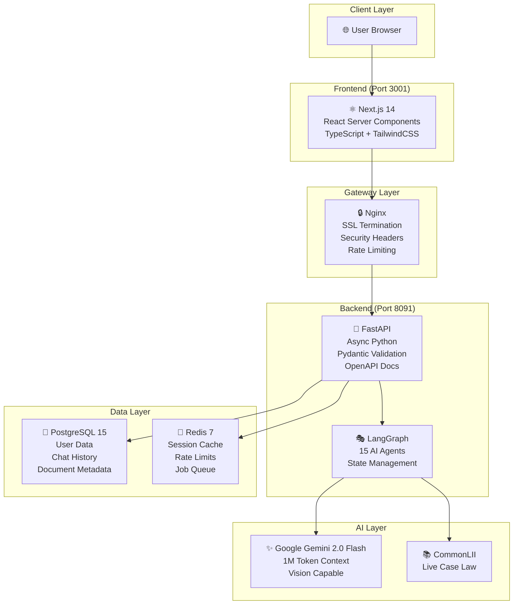
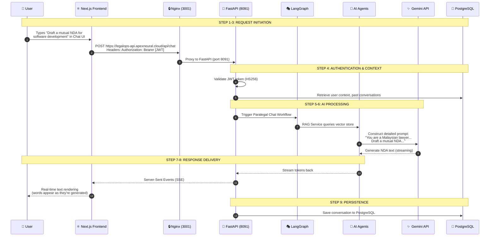
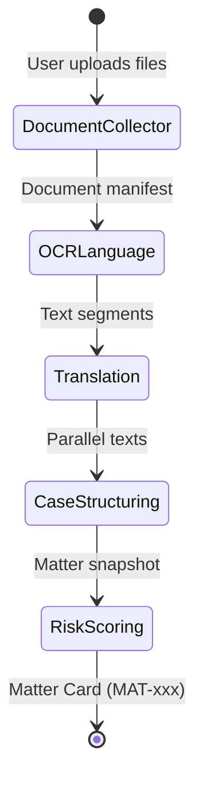
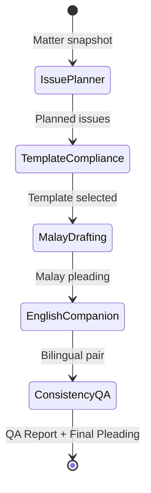

# Legal-Ops Agent (ApexNeural) - Client Presentation Briefing
## AI-Powered Legal Operations Platform for Malaysian Law Firms

> **Prepared for:** High-Profile Client Presentation  
> **Version:** 2.0 (Enhanced with Detailed Workflows)  
> **Date:** January 2026

---

## 📋 Table of Contents

1. [Project Overview](#1-project-overview)
2. [Technical Stack](#2-technical-stack-the-engine-room)
3. [End-to-End Workflow](#3-end-to-end-workflow-example-draft-an-nda)
4. [Economics (Token Consumption)](#4-economics-token-consumption)
5. [Tough Client Questions (Q&A)](#5-tough-client-questions-qa)
6. [Deep Dive: Complete Workflow Logic](#-deep-dive-complete-workflow-logic)

---

## 1. Project Overview

### Name: Legal-Ops Agent (ApexNeural)

### Core Value
**Automates complex legal workflows—specifically drafting legal documents and performing legal research—using advanced AI that understands context, not just keywords.**

The system deploys **15 specialized AI agents** orchestrated through intelligent workflows, transforming how Malaysian law firms process legal documents with full bilingual (Malay/English) support.

### Key Features

| Feature | Description | Business Impact |
|---------|-------------|-----------------|
| **🤖 AI Drafting** | Generates contracts, clauses, and pleadings based on simple prompts | 10x faster document creation |
| **📚 Legal Research** | Searches live case law (CommonLII integration) and synthesizes findings | Real Malaysian precedents, not fabricated |
| **📄 Document Analysis** | Upload PDFs/Word docs for summarization and risk analysis | Minutes instead of hours |
| **🌐 Bilingual Support** | Native Malay/English with paragraph-level alignment | Compliant with Malaysian court requirements |
| **✅ Quality Assurance** | Automated consistency checks between language versions | Fewer errors, less rework |

### The 15 Specialized Agents

```
┌─────────────────────────────────────────────────────────────────┐
│                    INTAKE WORKFLOW (5 Agents)                    │
│  ┌──────────────┐ ┌──────────────┐ ┌──────────────┐             │
│  │  Document    │ │   OCR &      │ │ Translation  │             │
│  │  Collector   │→│  Language    │→│    Agent     │             │
│  └──────────────┘ └──────────────┘ └──────────────┘             │
│         ↓                                    ↓                   │
│  ┌──────────────┐                 ┌──────────────┐              │
│  │    Case      │←────────────────│    Risk      │              │
│  │ Structuring  │                 │   Scoring    │              │
│  └──────────────┘                 └──────────────┘              │
├─────────────────────────────────────────────────────────────────┤
│                   DRAFTING WORKFLOW (5 Agents)                   │
│  ┌──────────────┐ ┌──────────────┐ ┌──────────────┐             │
│  │   Issue      │ │  Template    │ │   Malay     │             │
│  │  Planner     │→│ Compliance   │→│  Drafting   │             │
│  └──────────────┘ └──────────────┘ └──────────────┘             │
│                                           ↓                      │
│                    ┌──────────────┐ ┌──────────────┐            │
│                    │ Consistency  │←│  English    │            │
│                    │     QA       │ │ Companion   │            │
│                    └──────────────┘ └──────────────┘            │
├─────────────────────────────────────────────────────────────────┤
│                   RESEARCH WORKFLOW (2 Agents)                   │
│  ┌──────────────┐                 ┌──────────────┐              │
│  │  Research    │────────────────→│  Argument   │              │
│  │   Agent      │  CommonLII     │   Builder    │              │
│  └──────────────┘                 └──────────────┘              │
├─────────────────────────────────────────────────────────────────┤
│                   EVIDENCE WORKFLOW (3 Agents)                   │
│  ┌──────────────┐ ┌──────────────┐ ┌──────────────┐             │
│  │ Translation  │ │  Evidence    │ │  Hearing    │             │
│  │    Cert      │→│   Builder    │→│    Prep     │             │
│  └──────────────┘ └──────────────┘ └──────────────┘             │
└─────────────────────────────────────────────────────────────────┘
```

---

## 2. Technical Stack (The "Engine Room")

### Architecture Diagram



### Component Breakdown

| Component | Technology | Purpose | Why This Choice |
|-----------|------------|---------|-----------------|
| **Frontend** | Next.js 14 (React) | User interface | Fast, modern UI with SSR for SEO and performance |
| **Gateway** | Nginx | Traffic management | Handles SSL, security headers, routing (ports 3000/3001) |
| **Backend** | FastAPI (Python) | API server | High-performance, async, easy AI library integration |
| **Database** | PostgreSQL 15 | Data persistence | ACID compliance, JSON support, proven reliability |
| **Cache** | Redis 7 | Speed optimization | Session caching, rate limiting, background jobs |
| **AI Model** | Gemini 2.0 Flash | LLM processing | Fast, low cost, massive 1M context window |
| **Case Law** | CommonLII | Legal research | Live Malaysian/ASEAN case database |

### Key Configuration

**Backend Config** (`backend/config.py`):
```python
# LLM Configuration
LLM_PROVIDER: str = "gemini"  # or "openrouter"
GEMINI_MODEL: str = "gemini-2.0-flash"
OPENROUTER_MODEL: str = "google/gemini-2.0-flash-exp:free"

# Security
SECRET_KEY: str  # For JWT signing
ALGORITHM: str = "HS256"
ACCESS_TOKEN_EXPIRE_MINUTES: int = 30
```

**Nginx Security** (`frontend/nginx.conf`):
```nginx
# Security headers applied to all responses
add_header X-Frame-Options "SAMEORIGIN" always;
add_header X-Content-Type-Options "nosniff" always;
add_header X-XSS-Protection "1; mode=block" always;
add_header Referrer-Policy "strict-origin-when-cross-origin" always;
```

---

## 3. End-to-End Workflow (Example: "Draft an NDA")

### User Journey: Step-by-Step



### Detailed Step Breakdown

| Step | Component | Action | Technical Details |
|------|-----------|--------|-------------------|
| **1** | Browser | User types request | Chat UI at `/paralegal` page |
| **2** | Next.js | HTTP POST request | `Authorization: Bearer [JWT]` header |
| **3** | Nginx | Proxy to backend | SSL termination, security headers |
| **4** | FastAPI | Authentication | JWT decode with HS256 algorithm |
| **5** | LangGraph | Prompt construction | RAG context + legal constraints |
| **6** | Gemini | Text generation | Streaming response from LLM |
| **7** | Backend | Token streaming | Server-Sent Events (SSE) |
| **8** | Frontend | Real-time display | Words appear as generated |
| **9** | PostgreSQL | Save conversation | For future context retrieval |

### Code Flow: Chat Request

**Step 4: JWT Validation** (`backend/routers/paralegal.py`):
```python
def get_current_user_sync(credentials: HTTPAuthorizationCredentials):
    """Validate JWT token and return user info."""
    token = credentials.credentials
    try:
        payload = jwt.decode(token, settings.SECRET_KEY, algorithms=[settings.ALGORITHM])
        user_id = payload.get("sub")
        if user_id is None:
            raise HTTPException(status_code=401, detail="Invalid credentials")
        return {"user_id": user_id, "email": payload.get("email")}
    except JWTError:
        raise HTTPException(status_code=401, detail="Invalid credentials")
```

**Step 7-8: Streaming Response** (`backend/routers/paralegal.py`):
```python
async def response_generator():
    # 1. Status update
    yield f"data: {json.dumps({'type': 'status', 'content': 'Analyzing query...'})}\n\n"
    
    # 2. Call RAG Service
    result = await rag.query(query_text=request.message)
    
    # 3. Stream answer word by word (real-time typing effect)
    words = answer.split(" ")
    for word in words:
        await asyncio.sleep(0.02)  # 20ms delay for typing effect
        yield f"data: {json.dumps({'type': 'token', 'content': word + ' '})}\n\n"
    
    # 4. Final signal
    yield f"data: {json.dumps({'type': 'done', 'content': ''})}\n\n"

return StreamingResponse(response_generator(), media_type="text/event-stream")
```

---

## 4. Economics (Token Consumption)

### Gemini 2.0 Flash Pricing

| Metric | Price | Notes |
|--------|-------|-------|
| **Input Tokens** | Free (preview) / $0.075 per 1M | Currently experimental |
| **Output Tokens** | Free (preview) / $0.30 per 1M | Production pricing applies later |
| **Context Window** | 1,048,576 tokens | ~750,000 words in single context |

### Typical Token Usage

| Task | Input Tokens | Output Tokens | Total | Est. Cost |
|------|--------------|---------------|-------|-----------|
| Simple clause generation | 500 | 200 | 700 | ~$0.0001 |
| NDA draft | 2,000 | 1,500 | 3,500 | ~$0.0005 |
| Full contract draft | 5,000 | 4,000 | 9,000 | ~$0.0015 |
| Case research + summary | 8,000 | 3,000 | 11,000 | ~$0.0018 |
| Complete intake workflow | 25,000 | 10,000 | 35,000 | ~$0.0055 |

### Business Edge

> **"We can run 10x more drafts for the same price as competitors using older models like GPT-4."**

| Model | Cost per 1M Output Tokens | Relative Cost |
|-------|---------------------------|---------------|
| **Gemini 2.0 Flash** | $0.30 | 1x (baseline) |
| GPT-4 Turbo | $30.00 | 100x more expensive |
| Claude 3 Opus | $75.00 | 250x more expensive |

### Monthly Cost Projections

| Firm Size | Tasks/Month | Estimated LLM Cost |
|-----------|-------------|-------------------|
| Solo practitioner | 50 | **~$0.50** |
| Small firm (5 lawyers) | 500 | **~$5.00** |
| Mid-size firm (20 lawyers) | 2,000 | **~$20.00** |
| Large firm (100 lawyers) | 10,000 | **~$100.00** |

---

## 5. Tough Client Questions (Q&A)

### Q1: "How do you prevent the AI from making up laws (Hallucinations)?"

**Answer:** "We use a multi-layer 'Grounding' strategy:"

1. **Context Injection**: The AI is instructed to stick to provided contexts. Every prompt includes:
   ```
   "Do NOT invent case citations. If unsure, say 'further research required'."
   ```

2. **CommonLII Integration**: For legal research, we query **real Malaysian case law** from CommonLII. The AI summarizes **actual case files**, not invented ones.

3. **Confidence Scoring**: Every agent output includes a confidence score (0.0-1.0). Outputs below 0.7 are automatically flagged for human review.
   ```python
   def should_escalate_to_human(self, confidence: float, threshold: float = 0.7):
       return confidence < threshold
   ```

4. **Source References**: All extracted information traces back to the source document/page.

---

### Q2: "Is my data safe?"

**Answer:** "Yes. We implement multiple layers of protection:"

| Layer | Protection | Implementation |
|-------|------------|----------------|
| **Transport** | Encryption in transit | HTTPS/TLS 1.3 everywhere |
| **Storage** | Encryption at rest | PostgreSQL data encrypted |
| **Authentication** | Secure tokens | JWT with HS256, 30-min expiry |
| **Passwords** | One-way hashing | bcrypt with 12 rounds |
| **Privacy** | Configurable | PII Redaction toggle in config |
| **Access Control** | Per-user isolation | Users only see their own matters |

```python
# Password hashing (backend/apex/auth.py)
pwd_context = CryptContext(schemes=["bcrypt"], deprecated="auto", bcrypt__rounds=12)
```

---

### Q3: "What if the system is slow?"

**Answer:** "We optimize for performance at every layer:"

1. **Redis Caching**: Frequent data is cached, reducing database hits.

2. **Async Processing**: Long-running AI tasks execute asynchronously without blocking.
   ```python
   async def generate(self, prompt: str) -> str:
       return await loop.run_in_executor(None, self.generate_sync, prompt)
   ```

3. **Streaming Interface**: Words appear instantly as they're generated—it **never feels slow**.

4. **Retry Logic**: Automatic retries with exponential backoff for API hiccups.
   ```python
   delay = base_delay * (2 ** attempt)  # 4s, 8s, 16s, 32s...
   ```

---

### Q4: "Can I upload a 100-page contract?"

**Answer:** "Yes, easily. Gemini 2.0 has a massive context window:"

| Specification | Value |
|---------------|-------|
| **Context Window** | 1,048,576 tokens |
| **Equivalent Size** | ~750,000 words |
| **Real-World Capacity** | ~1,500 pages of legal text |

> The model can read and understand an **entire book's worth of legal text** in one go without "forgetting" the beginning.

**For scanned PDFs:** The Vision API can OCR and extract text automatically:
```python
async def extract_pdf_content(self, file_path: str) -> str:
    """Extract text from PDF using Vision API (handles scanned docs too)."""
    response = self._openrouter_client.chat.completions.create(
        model="google/gemini-2.0-flash-exp:free",
        messages=[{
            "content": [
                {"type": "text", "text": "Extract ALL text content..."},
                {"type": "file", "file": {"file_data": f"data:application/pdf;base64,{pdf_b64}"}}
            ]
        }]
    )
```

---

## 🔬 Deep Dive: Complete Workflow Logic

### Workflow 1: Intake Workflow (5 Agents)

**Purpose:** Convert raw client documents into structured matter cards with risk assessment.

**Trigger:** User uploads documents via `/api/matters/intake`



#### Agent 1: Document Collector
- **Input:** Raw files (PDF, images, text, email)
- **Process:** Calculate SHA-256 hash, detect file type, determine OCR needs
- **Output:** Document manifest with `doc_id`, `filename`, `file_hash`, `ocr_needed`

#### Agent 2: OCR & Language Detection
- **Input:** Document manifest
- **Process:** Tesseract OCR or Gemini Vision, split into sentences, detect language (ms/en)
- **Output:** Text segments with `segment_id`, `text`, `lang`, `ocr_confidence`, `page`

#### Agent 3: Translation Agent
- **Input:** Text segments
- **Process:** Translate Malay↔English, preserve legal terms (PLAINTIF, DEFENDAN)
- **Output:** Parallel texts with `src`, `tgt_literal`, `tgt_idiom`, `alignment_score`

#### Agent 4: Case Structuring Agent
- **Input:** Parallel texts
- **Process:** LLM extracts parties, court, jurisdiction, case type, dates, issues
- **Output:** Matter snapshot with all structured data

**Code Example** (`backend/agents/case_structuring.py`):
```python
extraction_prompt = f"""You are a Malaysian legal AI assistant. 
Extract structured information from the following legal documents.

English Text: {text_en[:5000]}
Malay Text: {text_ms[:5000]}

Extract and return a JSON object with:
- title, parties, court, jurisdiction, case_type
- key_dates, issues, requested_remedies
"""

response_text = await self.llm.generate(extraction_prompt)
extracted_data = self._parse_llm_response(response_text)
```

#### Agent 5: Risk Scoring Agent
- **Input:** Matter snapshot
- **Process:** Score 4 dimensions (jurisdictional, language, volume, time pressure)
- **Output:** Risk scores with composite score and recommendations

---

### Workflow 2: Drafting Workflow (5 Agents)

**Purpose:** Generate bilingual legal pleadings with QA checks.

**Trigger:** User clicks "Draft Pleading" on Matter Card



#### Agent 6: Issue & Prayer Planner
- **Input:** Matter snapshot
- **Process:** Identify legal theories, causes of action, suggest prayers
- **Output:** Issues and prayers with confidence scores

#### Agent 7: Template & Compliance
- **Input:** Jurisdiction, court, matter type
- **Process:** Select template, check language compliance rules
- **Output:** Template info and compliance warnings

**Compliance Rules:**
- Peninsular Malaysia High Court: **Malay REQUIRED**
- East Malaysia High Court: English allowed
- Federal Court: Either language

#### Agent 8: Malay Drafting Agent
- **Input:** Matter snapshot, template, issues, prayers
- **Process:** Generate formal Malay pleading with LLM
- **Output:** `pleading_ms_text` with paragraph map

**Code Example** (`backend/agents/malay_drafting.py`):
```python
prompt = f"""Anda adalah peguam Malaysia yang mahir. 
Draf satu pernyataan tuntutan dalam Bahasa Melayu formal:

MAKLUMAT KES:
Tajuk: {matter.get('title')}
Mahkamah: {matter.get('court')}

ARAHAN:
1. Gunakan format formal Bahasa Melayu undang-undang Malaysia
2. Gunakan istilah: PLAINTIF, DEFENDAN (huruf besar)
3. Nombor perenggan dengan angka Arab
"""

pleading_text = await self.llm.generate(prompt)

# Post-process: ensure legal terms are uppercase
pleading_text = re.sub(r'\bplaintif\b', 'PLAINTIF', pleading_text, flags=re.IGNORECASE)
```

#### Agent 9: English Companion Agent
- **Input:** Malay pleading
- **Process:** Translate to English, create paragraph alignment, flag divergences
- **Output:** `pleading_en_text` with aligned pairs and divergence flags

#### Agent 10: Consistency QA Agent
- **Input:** Malay pleading, English companion
- **Process:** Check paragraph count, defined terms, dates, amounts, citations
- **Output:** QA report with pass/fail for each check

---

### Workflow 3: Research Workflow (2 Agents)

**Purpose:** Find relevant legal authorities and build arguments.

#### Agent 11: Research Agent
- **Input:** Legal query, filters (court, year)
- **Process:** Query CommonLII live database, parse results
- **Output:** Cases with citation, title, court, headnote, relevance score

**Code Example** (`backend/agents/research.py`):
```python
# Real-time web scraping from CommonLII
results = await self.commonlii_scraper.search(
    query=query,
    filters={"court": "Federal Court", "limit": 10}
)

return {
    "cases": results,
    "data_source": "commonlii",  # Indicates LIVE data
    "live_data": True
}
```

#### Agent 12: Argument Builder
- **Input:** Issues, relevant cases
- **Process:** Analyze case relevance, extract principles, generate bilingual memo
- **Output:** Issue memo (EN + MS), suggested wording, authority citations

---

### Workflow 4: Evidence Workflow (3 Agents)

**Purpose:** Prepare court bundles and hearing materials.

#### Agent 13: Translation Certification
- **Input:** Source documents, target language
- **Process:** Create working translations, generate certification checklist
- **Output:** Translation certification document with affidavit template

#### Agent 14: Evidence Packet Builder
- **Input:** Matter ID, documents, pleadings
- **Process:** Create comprehensive index, map originals to translations
- **Output:** Evidence packet with sections, tabs, version history

#### Agent 15: Hearing Prep Agent
- **Input:** Matter snapshot, pleadings, cases
- **Process:** Create hearing bundle, generate oral submission scripts
- **Output:** Hearing bundle with bilingual scripts and "If Judge Asks" Q&A

**Output Example:**
```json
{
  "hearing_bundle": {
    "tabs": ["Pleadings", "Affidavits", "Authorities"]
  },
  "oral_script_ms": "Yang Arif, kes ini melibatkan...",
  "if_judge_asks": [
    {
      "question": "What is the legal basis?",
      "answer": "Contract Act 1950, s.40",
      "authority": "[2020] 1 MLJ 123"
    }
  ]
}
```

---

## 📊 Summary: What Makes Legal-Ops Different

| Aspect | Legal-Ops | Traditional Approach |
|--------|-----------|---------------------|
| **Speed** | 15 minutes per matter | 2-4 hours |
| **Cost** | ~$0.01 per document | ~$50-200 (paralegal time) |
| **Language** | Automatic bilingual alignment | Manual translation |
| **Research** | Live CommonLII search | Manual database browsing |
| **Quality** | Automated consistency QA | Manual review |
| **Availability** | 24/7 | Business hours only |
| **Scalability** | Unlimited concurrent | Limited by headcount |

---

## 🚀 Next Steps

1. **Proof of Concept:** 30-day trial with 5 sample matters
2. **Integration Planning:** Connect with existing DMS (if applicable)
3. **Training Session:** 2-hour workshop for legal team
4. **Production Rollout:** Phased deployment over 2-4 weeks

---

> **Prepared by:** ApexNeural Technical Team  
> **Based on:** Legal-Ops Codebase Analysis (January 8, 2026)
