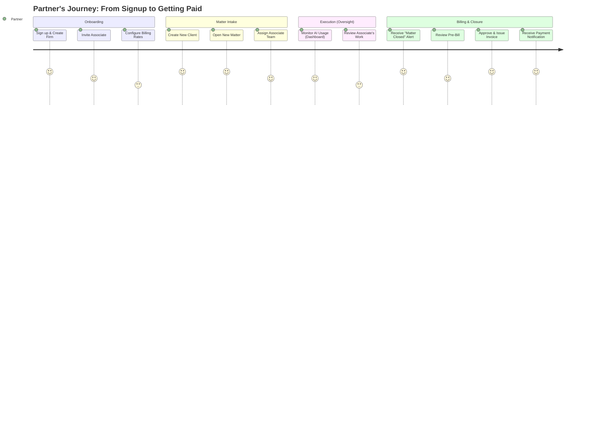
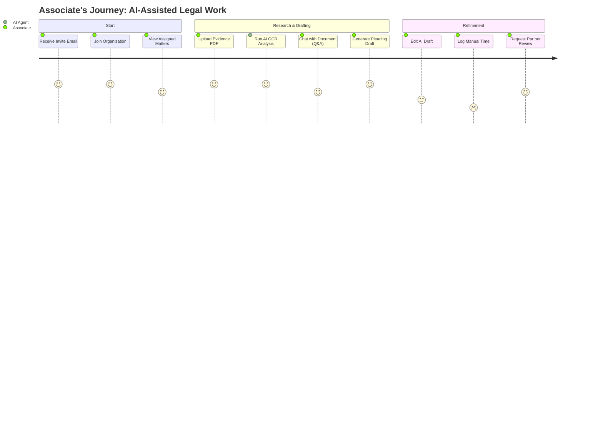
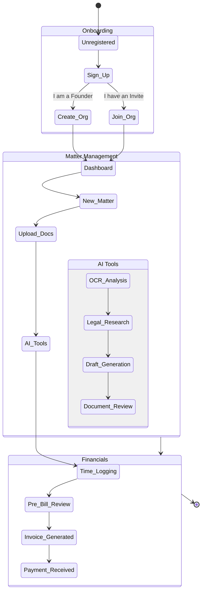

# Legal Ops AI — User Journey Maps

**Version**: 2.0 | **Date**: 21 January 2026

---

## 1. End-to-End User Journey (Partner View)

This diagram shows the complete lifecycle of a Partner setting up their firm and managing a case.

---

## 2. End-to-End User Journey (Associate View)

This diagram shows the day-to-day workflow of an Associate lawyer using the AI tools.

---

## 3. Detailed Process Flow (State Diagram)

A more technical view of the states a user moves through.

