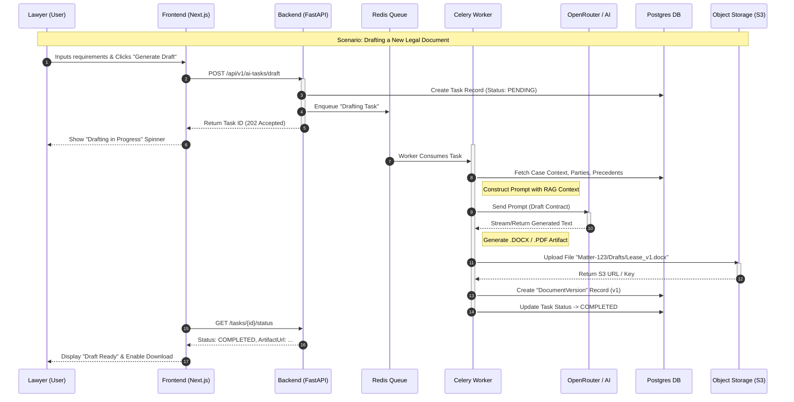
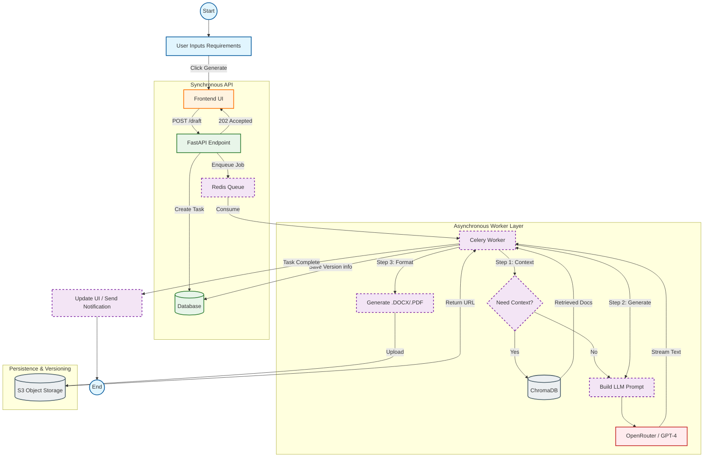

# System Workflows

## Core Asynchronous Workflows
This document outlines the detailed sequence of operations for the primary AI capabilities: **Legal Drafting** and **Hearing Preparation**. These flows rely on the Celery Async Layer to ensure responsiveness and proper version control via Object Storage.

### 1. Legal Drafting & Versioning Workflow
This flow demonstrates how a user requests a document to be drafted, how the system processes it asynchronously, and how it versions the output in S3.

### 3. High-Level Process Flowchart
This flowchart visualizes the decision logic and data movement across the system components.

### 2. Hearing Preparation & Argument Analysis
This flow shows the complex analysis of existing evidence to prepare a hearing strategy bundle.

```mermaid
sequenceDiagram
    autonumber
    participant U as Lawyer
    participant FE as UI
    participant Q as Redis
    participant W as Analyzer Worker
    participant VB as Vector DB (Chroma)
    participant S3 as S3 Storage

    U->>FE: Select "Prepare Hearing Strategy"
    FE->>Q: Push Job: ANALYZE_HEARING_STRATEGY
    
    Q->>W: Pick up Job
    
    rect rgb(20, 20, 20)
        note right of W: 1. Gather Evidence
        W->>VB: Query Relevant Facts & Contradictions
        VB-->>W: Retail list of embedding matches
    end
    
    rect rgb(30, 30, 30)
        note right of W: 2. Synthesize Arguments
        W->>W: Generate Strengths/Weaknesses Matrix
        W->>W: Predict Opposing Counsel Arguments
    end

    W->>S3: Save "Hearing_Bundle_v1.pdf"
    W->>S3: Save "Cross_Exam_Questions_v1.docx"
    
    W->>FE: Notify: "Hearing Prep Pack Generated"
```

